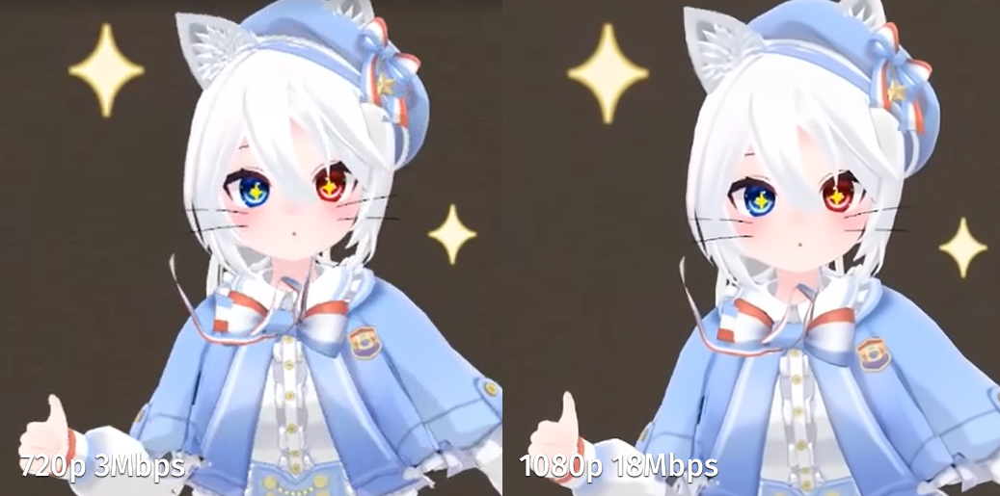
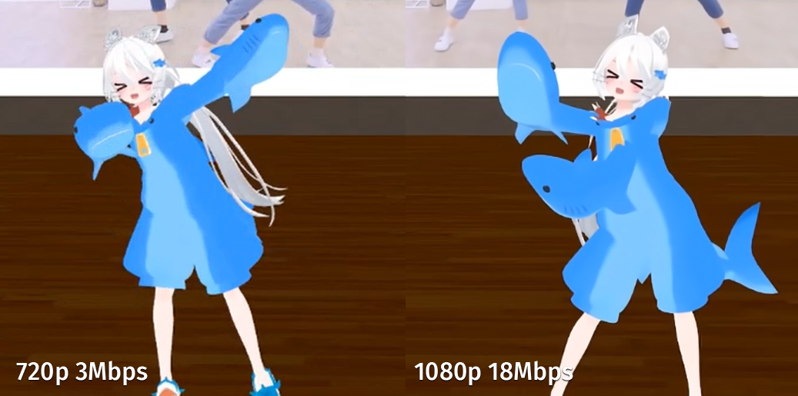
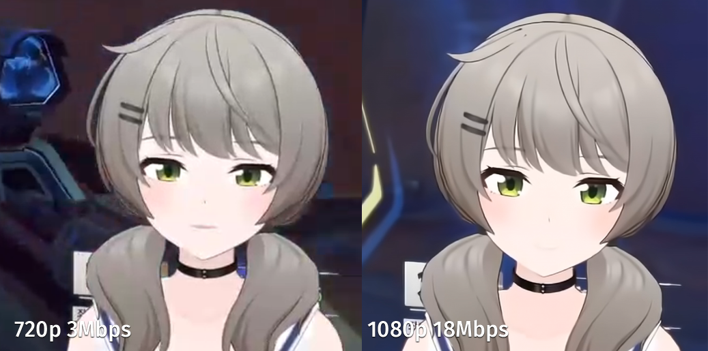
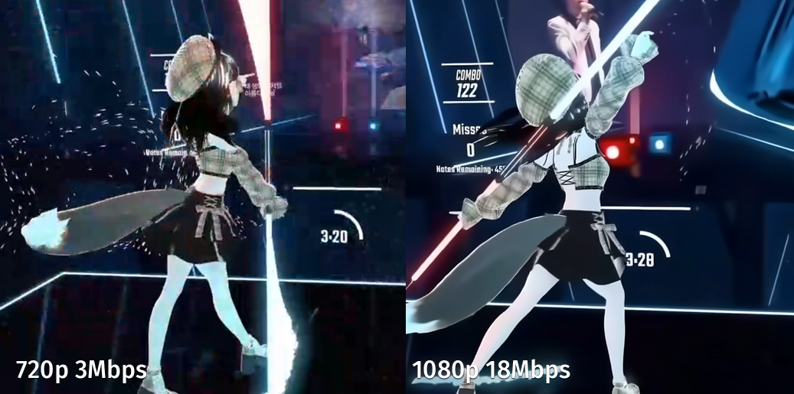
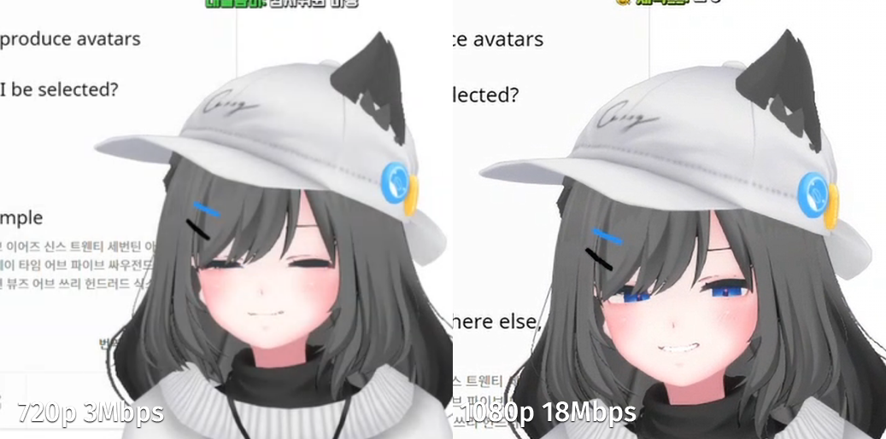

# SharkShark-4k

Make [SharkShark](https://www.twitch.tv/tizmtizm) into 4K.

Twitch Stream Upscaler 4K.

Written by AinL.

[Sample Video (https://www.youtube.com/watch?v=SXE-gIU3yJs)](https://www.youtube.com/watch?v=60-tXR3XW68)


# Introduction

트위치 720p에 지친 당신! 깨끗하고 선명하게 당신의 최애 방송을 보고 싶으신가요?

그렇다면 말 안듣는 트위치 말고, 당신의 GPU를 괴롭혀보는건 어떤가요!

RTX3090ti 두?장만 있다면 실시간으로 4k의 트위치 스트림을 볼 수 있답니다! 이제는 RTX4090 한장이면 충분하겠네요 (아마도)!

**이거 하려고 RTX4090을 샀습니다!!!!!!!**
```
# with RTX4090 + 3950x, 0.5% frame drop. 720p -> 1440p with RealESRGAN @ 24fps

python -m main.upscaler --url https://www.twitch.tv/tizmtizm
```

# Feature

- Realtime 1440p24 upscale from 720p60 on any Twitch live stream!
- Realtime 1440p24 upscale from 1080p60 on any Twitch live stream!
- Local file upscale from 1080p to 4K!

Upscaler pipeline is designed for handling high noise 720p Twitch stream.
Therefore, if you want to apply this upscaler to static image, you should reduce or disable denoiser.

# Samples


[Original Twitch Channel](https://www.twitch.tv/tizmtizm)


[Original Twitch Channel](https://www.twitch.tv/tizmtizm)


[Original Twitch Channel](https://www.twitch.tv/viichan6)


[Original Twitch Channel](https://www.twitch.tv/dancingshana)


[Original Twitch Channel](https://www.twitch.tv/mawang0216)

# To-Do

- Chrome extension for automatic upscaling image.
  - Upscale cache with CloudFlare R2.
- Good looking client interface.
- Faster upscaling model.
- Faster denoise model.

# Contribution

With Github issues and pull requests, you can make contributions!

All writings should be writen in English.

# References

BSVD, RealESRGAN, ESRGAN, FSRCNN
